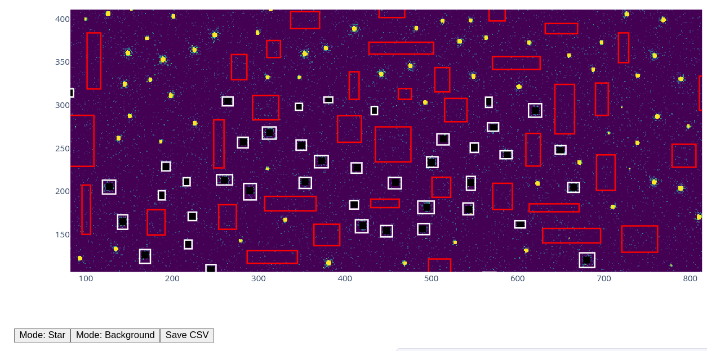

# Experimental PSF Photometry Tools

This repository contains experimental code for performing PSF photometry on astronomical images.

The current implementation focuses on interactive source selection and empirical PSF-based flux estimation.

## Features

- Interactive selection of stellar sources
- Interactive background region selection
- Empirical PSF (ePSF) construction
- PSF-based flux fitting

The photometric fitting is performed using `photutils` and supports user-provided PSF models.

## Motivation

The long-term objective of this project is to bridge classical PSF photometry with deep learning–based image segmentation.

The intended workflow is the following:

1. A small number of representative stars and background regions are selected interactively (e.g., ~20 sources).
2. These selections are used to construct labeled examples.
3. A deep learning model (e.g., a U-Net architecture) is then trained to generalize this information across the entire image.
4. The trained model automatically identifies and masks sources in the full field.

## Example Interface

Below is an example of the interactive environment used for source and background selection:

## Status

This codebase is experimental and under active development. Interfaces, APIs, and internal structure may change.

